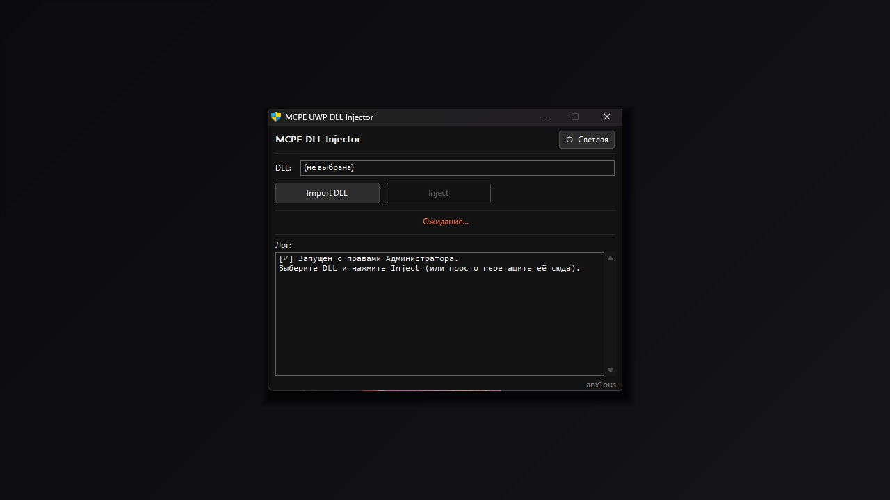

# MCPE UWP DLL Injector



Инжектор динамических библиотек (DLL) для **Minecraft Windows 10 Edition (UWP) 1.1.5**, написанный на чистом Win32 C++.

## ✨ Особенности / Features

* **Автоматическая настройка прав (UWP ACL helper)**: Инжектор автоматически выдает необходимые права `ALL_APPLICATION_PACKAGES` (SID `S-1-15-2-1`) на выбранную DLL, что критически важно для корректного внедрения в UWP-процессы.
* **Информативный лог (Log Console)**: Все этапы работы (поиск процесса, выдача прав, внедрение) выводятся в консоль приложения в реальном времени.

## 🛠️ Сборка / Build

Сборка осуществляется с помощью компилятора MinGW (g++) и утилиты windres для ресурсов.

### Требования:
* MSYS2 / MinGW 64-bit

### Команда для сборки:
Используйте готовый скрипт `build_gui.sh` в MSYS2:
```bash
./build_gui.sh
```

Или соберите вручную через терминал:
```bash
# Сборка ресурсов (манифест и иконка)
windres app.rc -o res.o

# Компиляция исполняемого файла
g++ -o mcpe_injector_gui.exe main.cpp res.o \
    -std=c++17 -O2 -m64 \
    -mwindows -municode \
    -DUNICODE -D_UNICODE \
    -static-libgcc \
    -Wl,-Bstatic -lstdc++ -lpthread \
    -Wl,-Bdynamic \
    -lkernel32 -luser32 -lgdi32 -ladvapi32 -lcomdlg32 \
    -ldwmapi -luxtheme -lcomctl32 -lshell32
```

## 👤 Автор / Author
* [anx1ous](https://t.me/anx1ous)
